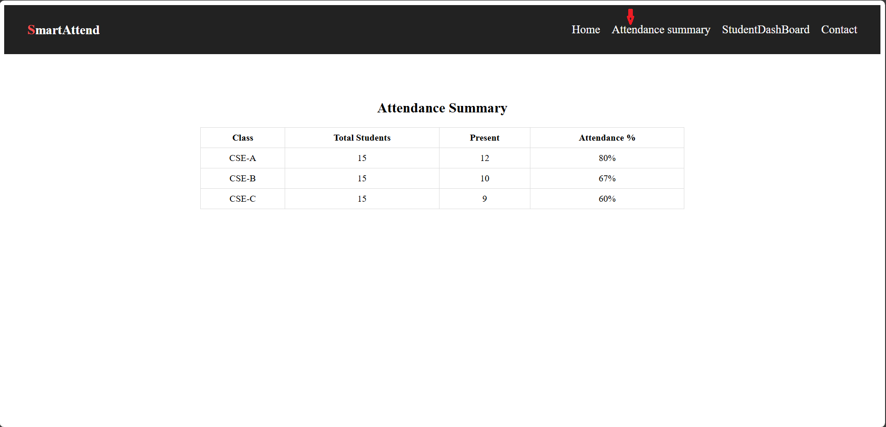
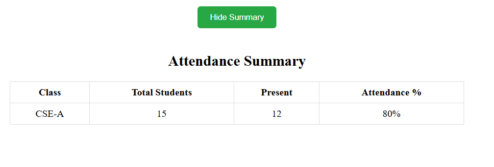

# 🎓 Student Attendance System  

The **Student Attendance System** is a web application developed with **React** that simplifies the process of marking and managing attendance.  

- Implements **React Router** for page navigation.  
- Uses **React Hooks** (`useState`, `useEffect`) for state management.  
- Component-based architecture for better reusability.  
- Simple UI with login authentication (demo version).  

---

## 🛠️ Tech Stack  
- **Frontend**: React.js, React Router, Hooks, Components  
- **Styling**: CSS  
- **Version Control**: Git & GitHub  

---

## 📂 Features  
✅ Login Page for user authentication  
✅ Student List display (section-wise like CSE-A, CSE-B, CSE-C)  
✅ Attendance toggle (Present/Absent)  
✅ Component-based UI for scalability  
✅ Responsive Design  

---

## Screenshots

### Login Page

*This is the login page where teachers enter their credentials to access the system.*

### Take Attendance CSE-A

### Take Attendance CSE-B

### Attendance Summary

### CSE Attendance Summary

### Contact Page

