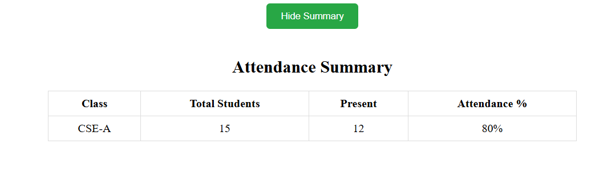

# 🎓 Student Attendance System  

The **Student Attendance System** is a web application developed with **React** that simplifies the process of marking and managing attendance.  

- Implements **React Router** for page navigation.  
- Uses **React Hooks** (`useState`, `useEffect`) for state management.  
- Component-based architecture for better reusability.  
- Simple UI with login authentication (demo version).  

---

## 🛠️ Tech Stack  
- **Frontend**: React.js, React Router, Hooks, Components,API fetching 
- **Styling**: CSS  
- **Version Control**: Git & GitHub  

---

## 📂 Features  
✅ Login Page for user authentication  
✅ Student List display (section-wise like CSE-A, CSE-B, CSE-C)  
✅ Attendance toggle (Present/Absent)  
✅ Component-based UI for scalability  
✅ Responsive Design  

---

## Screenshots

### Login Page
  
Teachers enter their credentials on the login page. After a successful login, they are redirected to the **Take Attendance** page.

### Take Attendance CSE-A
  
*Interface for marking attendance of students in CSE-A section.*
**Other Sections**  
   Teachers can switch to other sections (CSE-B or CSE-C) to take attendance and view summaries similarly.

### Attendance Summary CSE-A
  
*This summary appears when the teacher clicks "View Summary" after taking attendance. It shows detailed attendance records for CSE-A students.*

### Take Attendance CSE-B
  
*Interface for marking attendance of students in CSE-B section.*

### Attendance Summary CSE-B
  
*This summary appears when the teacher clicks "View Summary" after taking attendance. It shows detailed attendance records for CSE-B students.*

### Take Attendance CSE-C
  
*Interface for marking attendance of students in CSE-C section.*

### Attendance Summary CSE-C
  
*This summary appears when the teacher clicks "View Summary" after taking attendance. It shows detailed attendance records for CSE-C students.*

### Overall Attendance
  
*Shows the overall class attendance percentage for all students across all sections.*

#### Student Dashboard 1
  
*Main dashboard for students, showing a quick overview of today’s attendance and available sections.*

#### Student Dashboard 2
  
*Displays detailed attendance for the student, including who is present and absent for each section.*

#### Student Dashboard 3
  

### Contact Page
  
*This page displays the contact information of teachers, such as email, phone number, or other relevant details, so that students can get in touch with them.*
